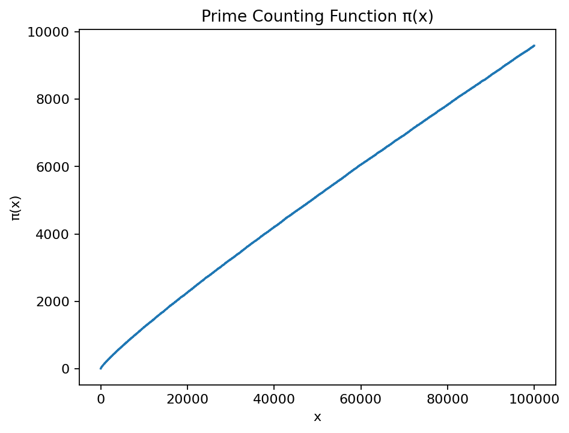

# Prime Generator: n²+1 Form Primes and Gap Analysis

A C++ implementation for finding prime numbers of the form $n^2+1$ up to a specified upper bound, with comprehensive prime gap analysis and planned Python visualisation integration.

## Overview

This project generates prime numbers that follow the specific form $n^2+1$ where $n\in\mathbb{Z^+}$. The program efficiently computes all such primes up to a given upper bound and calculates the gaps between consecutive primes in the sequence.

### Mathematical Background

Primes of the form $n^2+1$ are a fascinating subset of prime numbers. While evaluating natural numbers of the form $n^2+1$ is simple, determining which of these are prime presents interesting mathematical challenges. This implementation provides a computational approach to explore these patterns. For the remainder of this README, primes of the form $n^2+1$ will be referred to as $q$-primes.

## Features

- **Prime Generation**: Efficiently finds all $q$-primes up to a given bound
- **Gap Analysis**: Calculates gaps between consecutive primes in the sequence
- **Memory Efficient**: Optimised algorithms for handling large upper bounds
- **Array Output**: Prints structured arrays suitable for further analysis
- **Extensible Design**: Prepared for Python integration and visualisation

## Implementation Details

### Core Algorithm

The program iterates through values of n and:
1. Calculates $n^2+1$ for each $n$
2. Tests primality of the result
3. Stores valid primes in an array
4. Computes gaps between consecutive primes

### Data Structures

- **Prime Array**: Stores all discovered $q$-primes
- **Gap Array**: Contains the differences between consecutive primes
- **Efficient Storage**: Uses appropriate data types for the specified upper bound

## Output Format

The program produces four arrays:

### Prime Array
Contains all primes $p$ up till the upper bound.

### Filtered Prime Array
Contains all $q$-primes $\le N$.

### Gap Array  
Contains the differences between consecutive primes: $g_i = p_{i+1} - p_i$

### Example
Running the program with an upper bound of `3,000` produces: $$q=[2, 5, 17, 37, 101, 197, 257, 401, 577, 677, 1297, 1601, 2917]$$ 
$$g = [3, 12, 20, 64, 96, 60, 144, 176, 100, 620, 304, 1316, 220, 1220]$$ 

## Visualisations
This project includes Python visualisations that leverage the prime generation algorithms to create insightful statistical plots and distributions.

### Histogram of Prime Gap Frequencies

This histogram displays the frequency distribution of gaps between consecutive $q$-primes. Some interesting statistics are: 
- Mean: 1971.9
- Median: 1336
- Min: 3
- Max: 9344
- Quartile 1 (Q1): 649
- Quartile 3 (Q3): 2778

### Prime Counting Function $\pi(x)$

This is a plot of the number of (general) primes $\le x$. It is a well-known approximation that $\pi(x) \approx \frac{x}{\ln x}$ for large $x$.

### Specialised Counting Function $\pi_q(x)$

This is a plot of the number of $q$-primes $\le x$. The $y$-axis has a much smaller scale than the $\pi(x)$ plot, and it takes a more logarithmic shape than the almost-linear $\pi(x)$ plot.

## Performance Considerations

- **Time Complexity**: 
    - Sieve Construction: $O(N\log \log \sqrt{N})$ for the optimised Sieve of Eratosthenes
    - Prime Generation: $O(\sqrt{N})$ iterations to check all $k$ where $k^2+1\le N$
    - Gap Calculation: $O(\pi(N))$, where $\pi(N)$ is the number of primes $\le N$
    - Overall Complexity: $O(N\log \log \sqrt{N}+\sqrt{N}+\pi(N))$

- **Space Complexity**: 
    - Sieve Storage: $O(N)$ bits using ``uint8_t`` array and storing only odd numbers
    - Prime Arrays: $O(\pi(N))$ for all primes and $O(\pi_q(N))$ for $q$-primes
    - Gap Arrays: $O(\pi(N))$ and $O(\pi_q(N))$
    - Total Space: $O(N)$

- **Key Optimisations**:
    - Sieve only up till $\sqrt{N}$
    - Skip odd $k$ as $k^2+1$ must be odd
    - Direct index access ($O(1)$)
    - Odd-only sieve
## Upcoming Features

### Python Integration
- **Data Export**: Export prime and gap arrays to Python-compatible formats
- **Visualisation Tools**: Generate graphs and plots of prime gaps
- **Statistical Analysis**: Advanced gap distribution analysis
- **Interactive Exploration**: Tools for exploring patterns in the data

### Planned Visualisations
- Gap distribution histograms
- Prime density plots
- Gap sequence analysis
- Comparative studies with other prime forms

## Future Directions

- Comparison with other quadratic forms ($n^2+k$)
- Statistical analysis of gap distributions
- Computational improvements for larger bounds
- Pattern recognition in gap sequences
